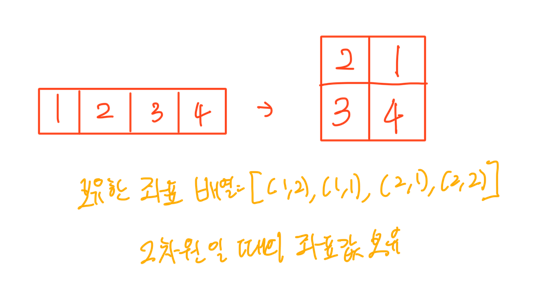

# Sam의 피자학교

걸린 시간: 3시간 30분

`플레5`

[코드트리 | 코딩테스트 준비를 위한 알고리즘 정석](https://www.codetree.ai/training-field/frequent-problems/problems/sam-pizza-school/description?page=2&pageSize=20)

어려웠던 점
- 1차원을 2차원으로 관리하고 계속 변경해주는 작업이 꽤나 복잡

아쉬웠던 점
- 도우를 누른다는 기능에 대해 지문만으로 빠르게 이해하지 못했다..
- 설계에 대한 검증이 너무 오래걸렸다
    - 데이터 타입을 이렇게 가져가는 게 맞을까, 회전할 땐 n*n 의 크기로 만들고 회전해야할까 등등의 생각들이 떠오르고, 검증이 오래걸림
- 해설에선 2차원을 만들지 말고, 아래처럼 기존의 1차원이 2차원으로 되었을때의 좌표를 가지고 문제를 해결한다.
    - 이런 생각은 못했다.
      - 좌표값을 회전시킨다는 생각은 안 해봤다…
    

좋았던 점
- 그래도 혼자 힘으로 푼 거
- 도우를 말고 접을 때의 기준 선(빨간 점선) 에 대한 처리를 빠르게 생각해낸 점