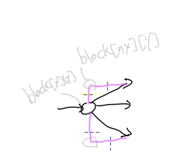

# 냉방 시스템

걸린 시간: 2시간 30분

`플5`

[코드트리 | 코딩테스트 준비를 위한 알고리즘 정석](https://www.codetree.ai/training-field/frequent-problems/problems/cooling-system/description?page=2&pageSize=20)

벽을 어떻게 세팅할 건지, 에어컨 바람을 어떻게 표시할 건지가 관건이였던 문제

아쉬웠던 점

- 코드를 좀 더럽게 짰다
    - 그러다보니 잔 실수가 많이 나옴
- `early return` 이 습관화 되어있어서, 자꾸 조건만 안 맞으면 바로 `continue` 시켜 버리는데, 이 문제는 그랬으면 안됐다.(여기서 틀림)

해설에서 좋았던 점

- 벽을 3차원으로 가져갔던 점
- 매우 간단히 바람의 대각선 처리

    ```python
    # Case 2. 대각선 방향으로 전파되는 경우입니다.
    if dxs[move_dir] == 0:
      for nx in [x + 1, x - 1]:
        ny = y + dys[move_dir]
        # 꺾여 들어가는 곳에 전부 벽이 없는 경우에만 전파가 가능합니다.
        if in_range(nx, ny) and not visited[nx][ny] and \
           not block[x][y][rev_dir(nx - x, 0)] and not block[nx][y][move_dir]:
             spread(nx, ny, move_dir, power - 1)
    else:
      for ny in [y + 1, y - 1]:
        nx = x + dxs[move_dir]
        # 꺾여 들어가는 곳에 전부 벽이 없는 경우에만 전파가 가능합니다.
        if in_range(nx, ny) and not visited[nx][ny] and \
           not block[x][y][rev_dir(0, ny - y)] and not block[x][ny][move_dir]:
             spread(nx, ny, move_dir, power - 1)
        
    ```

  아래 그림을 예시로 들겠다.

  오른쪽이기에 첫번째 조건문을 탄다. nx 를 `x+1`, `x-1` 로 두고, ny 는 이동 방향으로 `+` 해준다.
  여기선 벽을 3차원으로 가지는데, 조건문에서 처럼 `rev_dir()` 이란 함수로, block[x][y][?] ? 를 구해준다.
  ? 는 아래 그림에선 `위` 방향 이다. 그리곤 block[nx][ny][?] 에선 이동 방향의 벽을 확인한다.




좋았던 점

- 벽에 대한 활용을 잘했다.
    - 왼쪽, 위쪽 벽에 대한 입력을 받고, 그걸 가지고 오른쪽, 아래쪽까지 모두 세팅해줘서 벽 처리를 쉽게 했다.
- 바람에 대한 코드를 자꾸 습관적으로 코드를 예쁘게 짜려다보니 늦어질 뻔 했는데, 일단은 시간내에 풀어야 하기에 조금은 더럽게 짰다.
    - 시간이 남으면 모르지만 시간이 촉박하면 이처럼 일단 짜는 게 좋은 듯(맞다 틀리다가 아닌 예쁘다 못 생겼다일 땐)